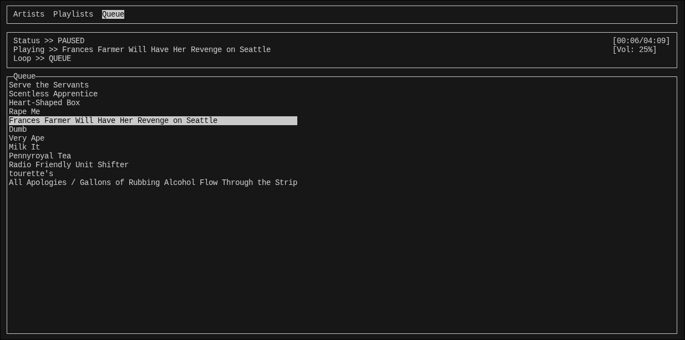

[](LICENSE)

# TMusicPlayer (Terminal Music Player)

  A terminal-based Subsonic client written in C.

## Dependencies
- OpenSSL
- libcurl
- json-c
- ncurses
- libxml2
- mpv
- pkg-config
- glib2
- gcc
- make

Note: on some distros the "devel" variant of the packages might be needed

## Compiling 
  
  Compile with `make`.

## Paths/Configuration

  The app expects a `config.json` file in the path: `$HOME/.config/tmusicplayer`, the folder will be created automatically the first time the app is opened but the file must be put there manually.

### Example

```json
  {
    "host":"http://subsonic.server",
    "name":"username",
    "password":"plain-text-password"
  }
```
  
  Another file will be created automatically and it will contain the app settings.

### Example

```json 
  {
    "volume":50,
    "__comment_1":"increase\/decrease of volume for a single click (min 1, max 5)",
    "vol-step":5,
    "playlist-loop":0,
    "scrobble":false,
    "__comment_2":"percent of song played before scrobbling",
    "scrobble-time":30
  }
```

## WARNING

  This app is in early development! Expect bugs, missing features, and potential crashes.

## Features
  
- Browsing in the order Artist->Album->Songs
- Queue control: add/remove songs, add albums, skips
- MPRIS integration
- Scrobble
- Library selection

## Controls

| Key           | Action                         |
|---------------|--------------------------------|
| `p`           | Play/Pause toggle              |
| `-` / `=`     | Lower/Raise volume by 5        |
| `ESC` / `←`   | Go back in navigation          |
| `ENTER` / `→` | Select                         |
| `↑` / `↓`     | Move in the menu               |
| `1`/`2`/`3`   | Switch TAB in top bar          |
| `q`           | Quit                           |
| `l`           | Change loop status             |
| `d`           | Remove song from queue         |
| `j`           | Skip backward                  |
| `k`           | Skip forward                   |
| `a`           | Add Album or Song to queue     |


## Screenshots
  
  
